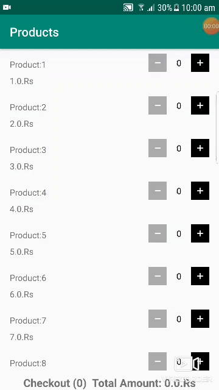
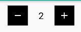

# ShoppingCart

Shopping cart is a small Kotlin android library that provide you cart managment feature like add, remove and calculate total items and amount. This library used coroutine to make cart management fast and used Room DB to save cart items.



### Installation

``` implementation 'de.starkling.shoppingcart:shoppingcart:1.0.0' ```

### Usage

First you need to make your existing model class a Saleable type by implementing the [`Saleable`](https://github.com/zabi90/ShoppingCart/blob/master/shoppingcart/src/main/java/de/starkling/shoppingcart/models/Saleable.kt) Interface. We have Product in our sample app.

```
data class Product(var id:String, var name:String ... ) : Saleable 
```
and override the methods that Saleable provides you.

```
    override var itemQuantity: Int
        get()
      
    override fun getId(): String {
       return id // This will be the id of your product class
    }

    override fun getName(): String {
       return name // name of your class
    }

    override fun getPrice(): Float {
       return price // price of your product
    }

    override fun getQuantity(): Int {
        return itemQuantity // simply return override field
    }

    override fun getTotal(): Float {
        return itemQuantity * price // calculate total of cart item
    }
```


Then you need to access the CartManager instance by following line

```
val cartManager =  CartManager.getInstance(applicationContext)
```
Add Product into Cart by following line

```val product = Product("1","Egg",15)
  product.itemQuantity = 1 // product quantity need to be hold in cart 
  
  CoroutineScope(Dispatchers.Main).launch {
            cart.updateItem(item)
  }
```
You can get the total items count and price by following line via LiveData Observer

```
 cart.subscribeCartTotal().observe(this, Observer {
      totalTextView.text = "Checkout (${it.totalItems})  Total Amount: ${it.totalAmount}.Rs"
 })

```

We also provide function that take your existing products or items list come from api or an other source and map with existing cart item quantity.

```
 CoroutineScope(Dispatchers.Main).launch {
    val products = cart.mapWithCart(products)
 }        
```

Also you can remove item from cart use following method
```
cart.removeItem(product)
```

You can get the list of cart items from CartManager to show your cart items in recyclerView or for later use by following method

```
cart.getCartItems()
```
### Counter Widget
Library contain simple counter widget that usually used while adding item in cart. This widget only maintain count value.



Add following xml in your layout
```
    <de.starkling.shoppingcart.widget.CounterView
        android:id="@+id/counterView"
        android:layout_width="wrap_content"
        android:layout_height="wrap_content"
   />
   
```
Add listener to get counter updated value

```
    counterView.addCounterValueChangeListener(object :CounterView.CounterValueChangeListener{
         override fun onValueDelete(count: Int) {
                    //when value removed
                }

                override fun onValueAdd(count: Int) {
                    //when value added
                }
               
         })
```            
For more help and detail please checkout sample project. 

License
----

Apache License
